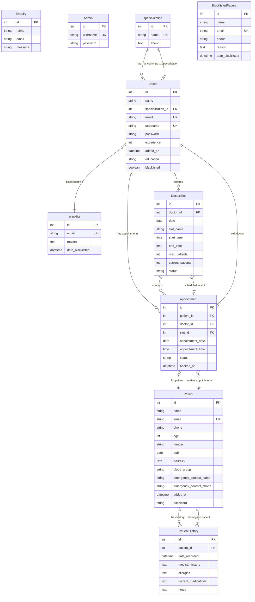

# 🏥 Hospital Management System (HMS)

A full‑stack **Hospital Management System web application** built using **Flask** and **SQLAlchemy**, designed to manage interactions between **Admins, Doctors, and Patients** through role‑based access and secure workflows. This project was developed as part of the **IIT Madras BS Program – App Development Project**.

---

## ✨ Key Features

### 👨‍💼 Admin

* Manage doctors and patients
* Blacklist / revoke doctors and patients
* View and manage all appointments
* Handle user enquiries
* Secure admin authentication & password management

### 🧑‍⚕️ Doctor

* Login with role‑based access
* Manage availability slots
* View & update appointment status
* Access patient medical history
* Add, edit, and delete patient records

### 🧑‍🦱 Patient

* Register & login securely
* Book, reschedule, or cancel appointments
* View appointment history
* Access personal medical records
* Update profile & change password

---

## 🧠 Project Approach

This project addresses real‑world hospital management challenges using a **modular Flask architecture**. The system ensures:

* Secure authentication with **Flask‑Login**
* Conflict‑free appointment scheduling
* Strong data integrity using **relational database models**
* Clean separation of concerns for scalability and maintainability

---

## 🏗️ Project Structure

```
Hospital-Management-System/
│── run.py                  # Application entry point
│── app/
│   ├── __init__.py         # App factory
│   ├── models.py           # Database models
│   ├── routes/             # Role-based routes
│   └── forms.py            # WTForms
│── templates/              # Jinja2 templates
│── static/                 # CSS & assets
│── requirements.txt        # Dependencies
│── README.md               # Documentation
```

---

## 🚀 Getting Started

### 1️⃣ Clone the Repository

```bash
git clone https://github.com/nikhilsri8052-a11y/chess-web-app.git
cd Hospital-Management-System
```

### 2️⃣ Create & Activate Virtual Environment

```bash
python -m venv venv
venv\Scripts\activate   # Windows
# source venv/bin/activate  # Linux / macOS
```

### 3️⃣ Install Dependencies

```bash
pip install -r requirements.txt
```

### 4️⃣ Run the Application

```bash
python run.py
```

Open **[http://127.0.0.1:5000/](http://127.0.0.1:5000/)** in your browser.

---

## 🗄️ Database Schema

The database is designed using **relational modeling** with clear one-to-many relationships to ensure data integrity, scalability, and real-world hospital workflows.

### 📊 Entity Relationship (ER) Diagram



> ✅ **Note:** GitHub supports Mermaid diagrams. If it does not render, you can export this diagram as an image using Mermaid Live.

### Tables

* Admin
* Enquiry
* Specialization
* Doctor
* Patient
* DoctorSlot
* Appointment
* PatientHistory
* Blacklist (Doctor)
* BlacklistedPatient

### Relationships

* One-to-Many: Specialization → Doctor
* One-to-Many: Doctor → Slots, Appointments, PatientHistory
* One-to-Many: Patient → Appointments, PatientHistory
* Slot-based appointment allocation
* Email-based blacklisting for doctors and patients

---

## 🔗 API Endpoints (Highlights)

| Endpoint                 | Method    | Description             |
| ------------------------ | --------- | ----------------------- |
| /admin_login             | GET       | Admin login             |
| /doctor_login            | GET       | Doctor login            |
| /patient_login           | GET       | Patient login           |
| /book_appointment/<id>   | GET, POST | Book appointment        |
| /doctor_appointments     | GET       | Doctor appointment list |
| /admin_view_appointments | GET       | View all appointments   |

*(Full endpoint list available in project report)*

---

## 🛠️ Tech Stack

* **Backend:** Flask (Python)
* **ORM:** SQLAlchemy
* **Auth:** Flask‑Login
* **Forms:** WTForms
* **Frontend:** HTML, CSS, Jinja2
* **Database:** SQLite

---

## 🤖 AI / LLM Usage Declaration

* CSS for styling
* Gemini AI used for debugging and error resolution
* VS Code suggestions
* Approx. **8% AI assistance**

---

## 🎥 Demo Video

📽️ [Project Walkthrough Video](https://drive.google.com/file/d/1mtfhLxU2VxA4Cxinjk84bm_cDjveB5_9/view?usp=sharing)

---

## 👤 Author

**Nikhil Sanjay Kumar Srivastava**
Student – IIT Madras 
📧 [24f2009229@ds.study.iitm.ac.in](mailto:24f2009229@ds.study.iitm.ac.in)

---

## ⭐ Acknowledgements

This project was built as part of the **IIT Madras App Development coursework**, focusing on real‑world system design, authentication, and database modeling.

If you like this project, consider giving it a ⭐ on GitHub!


